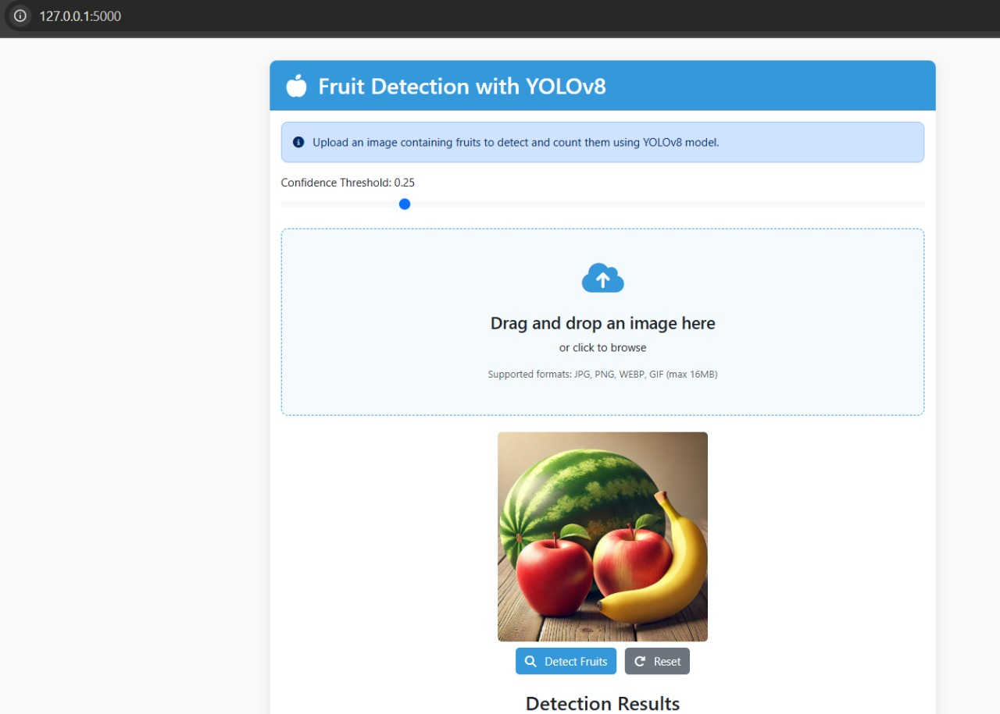
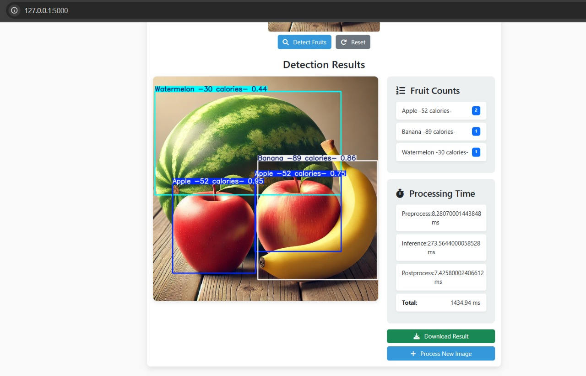

# Fruit Detection and Counting with YOLOv8

## Project Overview

This project implements a robust fruit detection and counting system using YOLOv8, capable of identifying and quantifying different types of fruits in an image with their respective calorie information.

## Features

- Detect multiple fruit types in a single image
- Count the number of fruits
- Provide calorie information for detected fruits
- Advanced data augmentation techniques
- Intuitive web interface for fruit detection

## Sample Results




## Key Technologies

- YOLOv8
- PyTorch
- Ultralytics
- Albumentations
- OpenCV

## Project Workflow

1. **Dataset Handling**
   - Load fruit detection dataset from Roboflow
   - Verify GPU availability
   - Prepare dataset for YOLOv8 training

2. **Data Augmentation**
   - Geometric transformations
   - Photometric adjustments
   - Advanced augmentation techniques

3. **Model Training**
   - Use pre-trained YOLOv8 model
   - Transfer learning
   - Log training progress
   - Save best performing model

4. **Post-Processing**
   - Refine detection results
   - Adjust Non-Maximum Suppression (NMS)
   - Accurate fruit counting strategy

## Performance Metrics

The model's performance was evaluated using various metrics:

- Precision
- Recall
- F1 Score
- Confusion Matrix

## Installation and Setup

### Prerequisites

- Python 3.8+
- CUDA-compatible GPU (recommended)

### Create Virtual Environment

```bash
# Create virtual environment
python -m venv venv

# Activate virtual environment
# On Windows
venv\Scripts\activate
# On macOS/Linux
source venv/bin/activate
```

### Install Dependencies

```bash
# Upgrade pip
pip install --upgrade pip

# Install requirements
pip install -r requirements.txt
```

### Dataset Preparation

1. Sign up on Roboflow
2. Import your fruit detection dataset
3. Export in YOLOv8 format
4. Update dataset path in code

### Training the Model

```bash
# Start model training
from ultralytics import YOLO

model = YOLO('yolov8n.pt')  # start with pre-trained model
results = model.train(data='path/to/your/data.yaml', epochs=50)
```

### Running Inference

```bash
# Load best model
model = YOLO('runs/detect/yolov8_fruit/weights/best.pt')

# Predict on test images
results = model.predict(source='test_images/', conf=0.5)
```

### Web Interface

```bash
# Run the web application
python app.py
```

## Troubleshooting

- Ensure CUDA is properly installed
- Check Python and library versions
- Verify dataset annotations

## Contributing

1. Fork the repository
2. Create your feature branch
3. Commit your changes
4. Push to the branch
5. Create a Pull Request

## Try Out the Model

You can try out the fruit detection model by visiting the following link:

[](https://huggingface.co/spaces/Sehajbir/fruit-detection-app)

Click the button above to access the fruit detection app hosted on Hugging Face Spaces. 


## License

[Specify your license here]

## Acknowledgements

- Ultralytics
- Roboflow
- PyTorch Team

## Contact

[Your Name/Contact Information]
